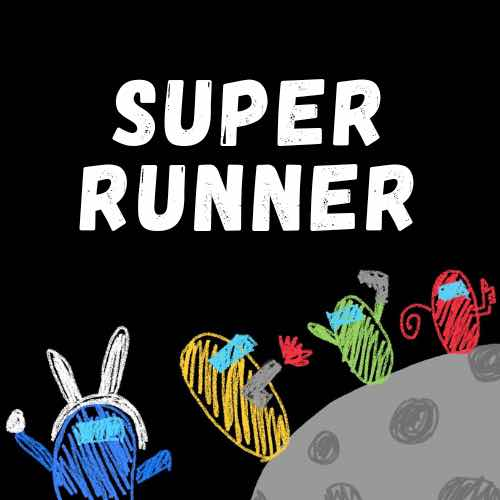
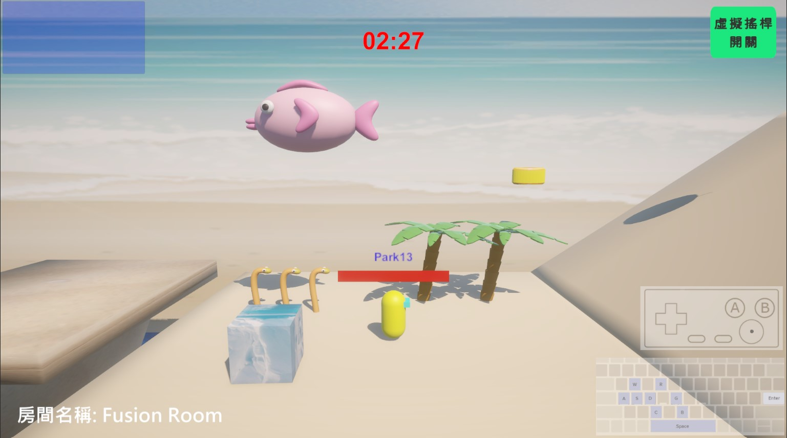
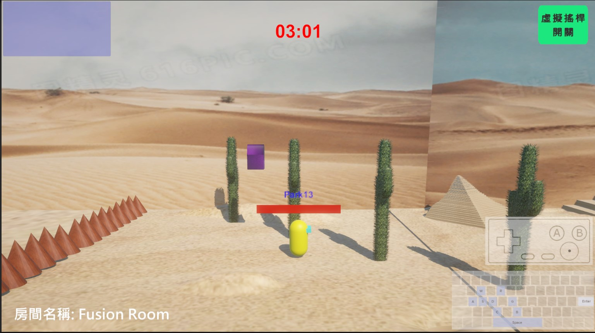
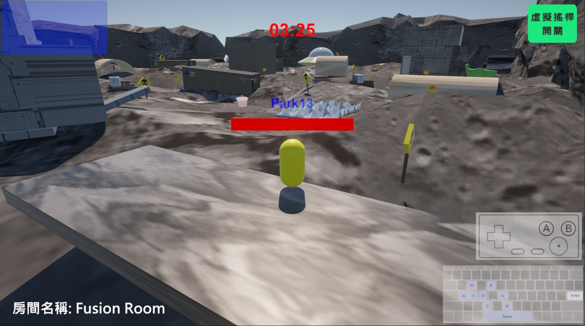
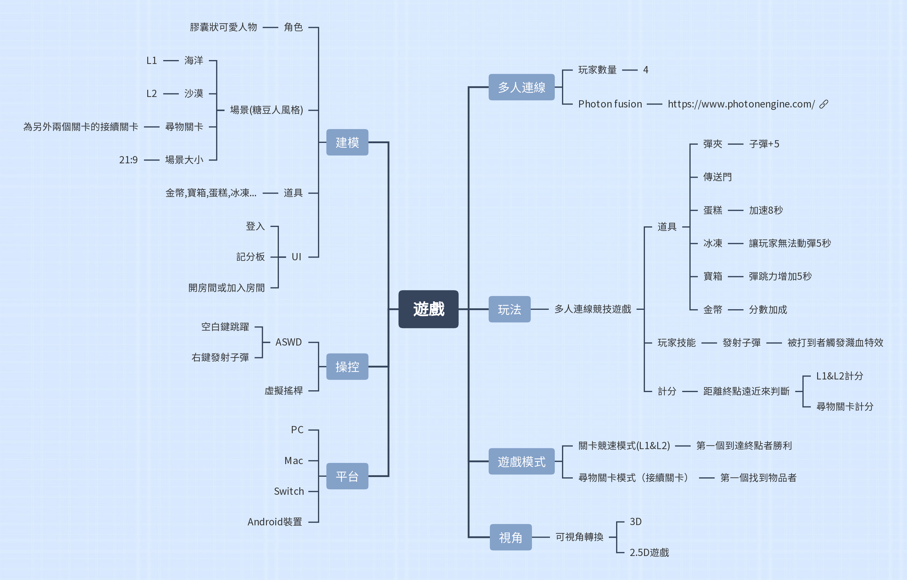

# SUPER RUNNER
SUPER RUNNER Introduction

SUPER RUNNER 是一款多人連線競技遊戲，提供三種不同的遊戲場景及兩種玩法，由最快到達終點的玩家獲勝。
在想方設法阻礙對手到達終點的同時，也不要栽在前方的陷阱和障礙面前。

**程式結構:** https://hackmd.io/s/rynMRIVB6

## Program Structure

### Client
**GamePlay**
- 遊戲的主要場景
- 介紹整體遊戲流程和玩家互動

**Main Functions**
- 角色生成
- 加入房間和遊戲流程
- 視角切換
- 分數計算和陷阱觸發
- 道具特效和終點邏輯
- 遊戲音效

**Main Code**
- BasicSpawner : 負責角色生成、加入房間、操作轉送等
- PlayerController : 控制遊戲流程，包括移動、視角、分數、陷阱等
- MyControls : 處理實體和虛擬搖桿輸入
- InputHandler：在玩家輸入好名字和房間名稱後，存檔供之後流程使用
- Camera : 處理玩家視角計算
- Tool : 處理遊戲中的道具
- CountdownTimer：本地運行的計時器

### Server

**以Flask為架構的Python程式**
- 透過HTTP API去存取SQL資料庫
- GET /players + Query String
- Get /leaderboard + Query String
- 定期重置排行榜

### API
- GetAllData: 獲取所有玩家數據
- GetPlayerData: 根據玩家名稱和遊戲會話獲取特定玩家數據
- SetPlayerData: 設置或更新玩家的數據
- ResetScore: 重置特定遊戲會話中所有玩家的分數
- ClearSession: 清除特定遊戲會話中所有玩家的數據
- GetSessionPlayers: 獲取特定遊戲會話中的所有玩家
- AddPlayerScore: 增加特定玩家在特定遊戲會話中的分數
- GetOrderPlayers: 根據分數降序排列特定遊戲會話中的玩家
- GetLeaderScore: 獲取排行榜上的最高分數玩家
- ResetLeaderScore: 重置排行榜上的分數
- UpdateLeaderScore: 更新排行榜上的玩家分數

## Game flow

## Tech skills
- Unity 
- Photon Fusion (Host Mode)
- GitHub
- Blender
- MySQL
- Flask

## Support
- PC 
- MacOS
- IOS
- Android
- Switch

## Game Features
- 鏡頭切換: 以 2.5D 視角為主，第三人稱視角為輔
- 虛擬搖桿: 行動裝置遊玩的輔助

### Logo

## Demo

- Level 1

- Level 2

- 尋物關卡

## 遊戲發想

