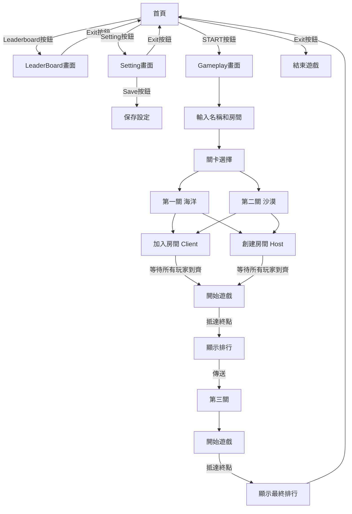
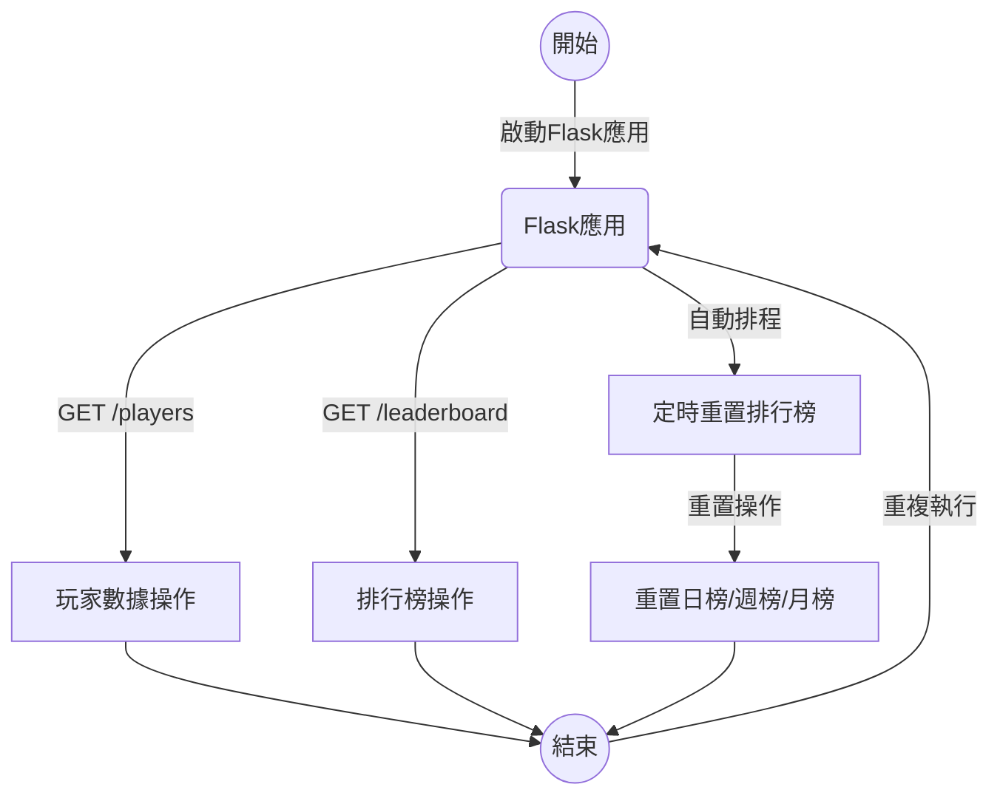

# 分類

## 1. 遊戲
### 場景及程式
  * **Start**：遊戲的開始畫面
      * **程式**：
          * **Start UI**：按鈕及一些Plane的處理
  * **GamePlay**：遊戲的主要場景
      * **程式**：
          * **BasicSpawner**：負責角色生成、加入房間、將操作送給Host等等
          * **PlayerController**：負責大部分的遊戲流程，包含角色位置隨操作移動、視角切換、分數計算、陷阱觸發、道具特效、終點邏輯、遊戲音效等等
          * **CountdownTimer**：本地運行的計時器
          * **NameInputHandler**及**SessionInputHandler**：在玩家輸入好名字和房間名稱後，存檔供之後流程使用
          * **MyControls**：處理實體搖桿和虛擬搖桿的輸入
          * **GamePadInputView**及**KBInputViewScript**：偵錯用，即時顯示搖桿及鍵盤輸入
          * **Camera**：負責處理Player視角的計算
          * **Tool** : 道具相關
* **Setting**：設定，可以修改玩家名稱及房間名稱
    * **程式**：
      * **SettingScript**：供玩家修改名稱及房間名稱用
* **LeaderBoard**：排行榜，可以顯示當日、當週及當月最高分玩家
    * **LeaderboardMain**：抓取最高分並且顯示在文字框內

## 2. SQL伺服器程式

### API

* **GetAllData**:
  * 獲取所有玩家數據。
  
* **GetPlayerData**:
  * 根據玩家名稱和遊戲會話獲取特定玩家數據。

* **SetPlayerData**:
  * 設置或更新玩家的數據。

* **ResetScore**:
  * 重置特定遊戲會話中所有玩家的分數。

* **ClearSession**:
  * 清除特定遊戲會話中所有玩家的數據。

* **GetSessionPlayers**:
  * 獲取特定遊戲會話中的所有玩家。

* **AddPlayerScore**:
  * 增加特定玩家在特定遊戲會話中的分數。

* **GetOrderPlayers**:
  * 根據分數降序排列特定遊戲會話中的玩家。

* **GetLeaderScore**:
  * 獲取排行榜上的最高分數玩家。

* **ResetLeaderScore**:
  * 重置排行榜上的分數。

* **UpdateLeaderScore**:
  * 更新排行榜上的玩家分數。

### 自動行為

* 排行榜自動清除
  * 每天0:00清除日榜。
  * 每週一0:00清除週榜。
  * 每月一號0:00清除月榜。
